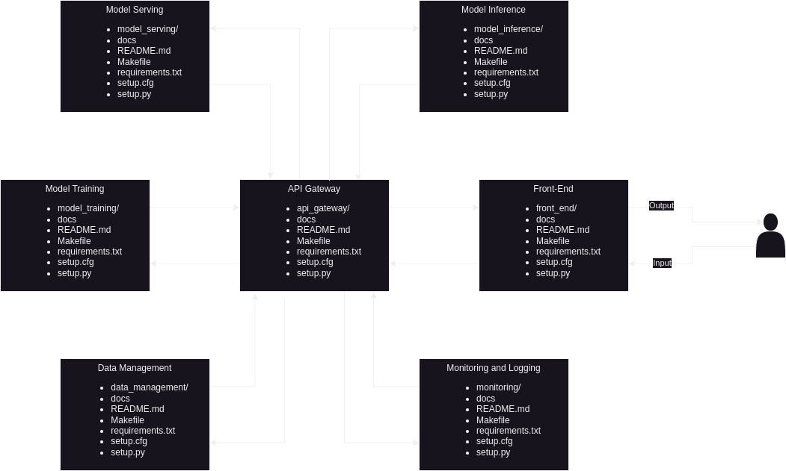

#  PyProject Microservices Template
PyProject Microservices Template is a Python based microservices project template. 
The template will have sample endpoints and a generic microservices architecture.

This template builds on top of Timothy Helton's Pyproject Generator: 
https://github.com/TimothyHelton/pyproject_generator



## PyProject Template Structure
- `docker`: Docker directory
  - `mongo_init`: Folder with mongo init related files
  - `Dockerfile`: Dockerfiles for building Docker container images
  - `docker-compose.yaml`: Yaml file used by Docker Compose to define the services, 
  networks, and volumes for a multi-container application
- `docs`: Folder used by sphinx for auto-documentation
- `scripts`: Folder with setup related scripts
- `service_apigateway`: API Gateway service for managing and routing requests
- `service_data_management`: Data Management service for data related tasks (ETL)
- `service_frontend`: Streamlit service with sample pages (missing test atm)
- `service_modelinference`: Model Inference service processing incoming data and 
returning inference results to the requesting applications.
- `service_modelserving`: Model Serving service providing an interface for external systems 
to interact with the models.
    - `configs`: Base configuration files
    - `test`: Base unit tests
- `service_modeltraining`: Model Training service training machine learning models
- `service_monitoring`: Monitoring and Logging service overseeing the health, performance, 
and operational aspects of the entire microservices architecture

Notes: future updates will include Endpoints as I continue to update other microservices

## Setting Up New Project
1. From current project root directory, run:
   - `make create-project`
     - `Enter the old project name: pyproject_microservices`
     - `Enter the new project name: new_project`
1. Current project directories and files are created in the new project directory
    - `new_project/`
1. The new project is created 1-level up from the current project root directory
   - if current project directory is `projects/pyproject_microservices` 
     then the new project is created at `projects/new_project`
1. To add to git:
   - `git init`
   - `git add <new_project_files_and_directories>`
   - `git commit -m "first commit or any comments"`
   - `git branch -M main`
   - `git remote add origin https://github.com/<user_or_organization>/<project>.git`
   - `git push -u origin main`

## Getting Started With the New Project
 is a fully functioning Python package that may be installed using
`pip`.
Docker Images are built into the package and a Makefile provides an easy to call
repetitive commands.

### Makefile Code Completion
It's handy to have code completion when calling targets from the Makefile.
To enable this feature add the following to your user profile file.
- On Ubuntu this would be your `~/.profile` file.
- On a Mac this would be you `~/.bash_profile` file.
```bash
complete -W "`grep -oE '^[a-zA-Z0-9_.-]+:([^=]|$)' Makefile | sed 's/[^a-zA-Z0-9_.-]*$//'`" make
```

### Clone the Repository
First, make a local copy of the project.
After setting up SSH keys on GitHub call the following command to clone the
repository.
```bash
git clone <enter_path_to_repo>.git
```
A directory called `pyproject_microservices` will be created where the 
command was executed. This `pyproject_microservices` directory will be 
referred to as the "package root directory" throughout the project.

### Initialize the Project
Some functionality of the package is created locally.
Run the following command from the package root directory to finish setting up
the project.
```bash
make getting-started
```

### Jupyter Notebooks
While Jupyter notebooks are not ideal for source code, they can be powerful
when applied to path finding and creating training material.
The pyproject_microservices project is capable of creating a Jupyter 
server in the Python container. Since the package root directory is mounted to 
the Docker container any changes made on the client will persist on the host and
vice versa. For consistency when creating notebooks please store them in the 
`notebooks` directory. Call the following commands from the package root 
directory to start and stop the Jupyter server.

#### Create a Notebook Server
```bash
make notebook
```

#### Shutdown a Notebook Server
```bash
make notebook-stop-server
```

### Test Framework
The  is configured to use the pytest test framework in conjunction with
coverage and the YAPF style linter.
To run the tests and display a coverage report call the following command from
the package root directory.

#### Test Coverage
```bash
make test-coverage
```

To only run the tests, and not display the coverage, call the following.

### Tests
```bash
make test
```

#### Update Style
To only run the YAPF style linter call this command from the package root
directory.
```bash
make format-style
```

## Dependencies
Since the pyproject_microservices utilizes NVIDIA optimized Docker 
images most of the Python dependencies could be installed using PIP or Conda.
The `requirements.txt` file contains a reference to the specific
base image used during development and a list of dependencies.

There is a make target to update the requirements file.

```bash
make package-dependencies
```

## Documentation
The package also has an NGINX container to host interactive documentation.
Calling the following commands from the package root directory will result in
a local web browser displaying the package HTML documentation.

### Build Documentation
```bash
make docs
```

### View Documentation without Building
```bash
make docs-view
```

## Profilers
Before refactoring it's usually a ***great*** idea to profile the code.
The following methods describe the profilers that are available in the 
pyproject_microservices environment, and how to use them.


### SNAKEVIZ Execution
To test an entire script just enter the following from the project root
directory.

#### Profile Script
```bash
make snakeviz PROFILE_PY=script.py
```

### Memory Profiler
1. Open Jupyter Notebook
1. Load Extension
    - `%load_ext memory_profiler`
1. Run profiler
    - `%memit enter_code_here`

